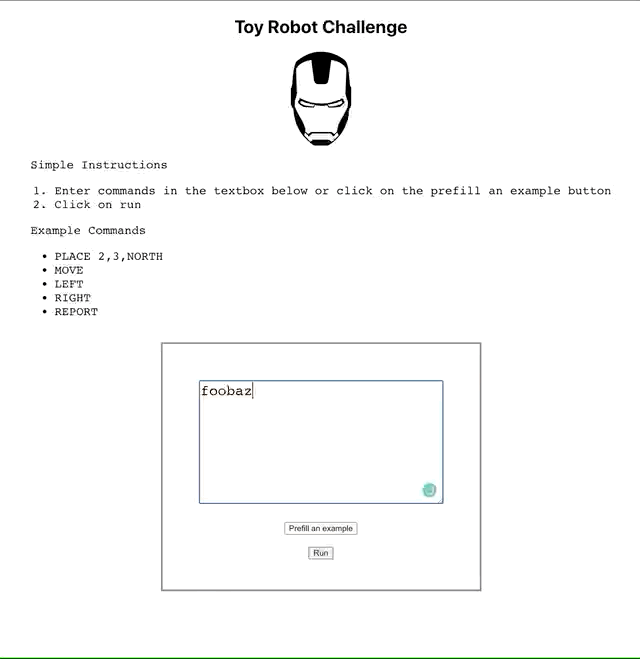

## ;TLDR

An app to display the position of a toy robot

---

## Animated demo below

### Valid commands demo

### Invalid commands demo

---

## Notes

1. Chosen to use a create-react-app, [CRA](https://github.com/facebook/create-react-app), to provide an interface for user input
2. There is a button to prefill an example command sequence (to simulate test data to exercise the application)
3. Simple input validation was implemented to cater for most cases of errorneous user input

## Instructions

To run on a your local machine

1. Clone this repo
2. run `yarn install`
3. run `yarn start`
4. On a browser, go to `localhost:3000`

To run test

1. run `yarn test`
